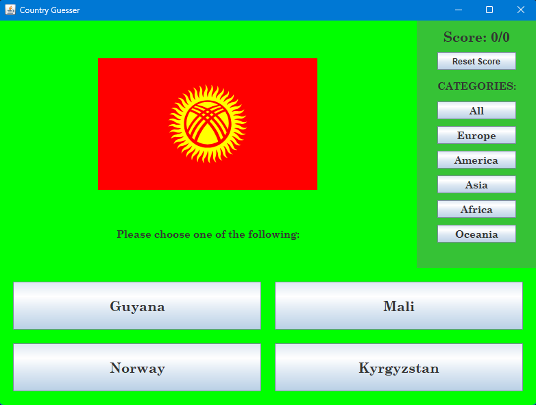
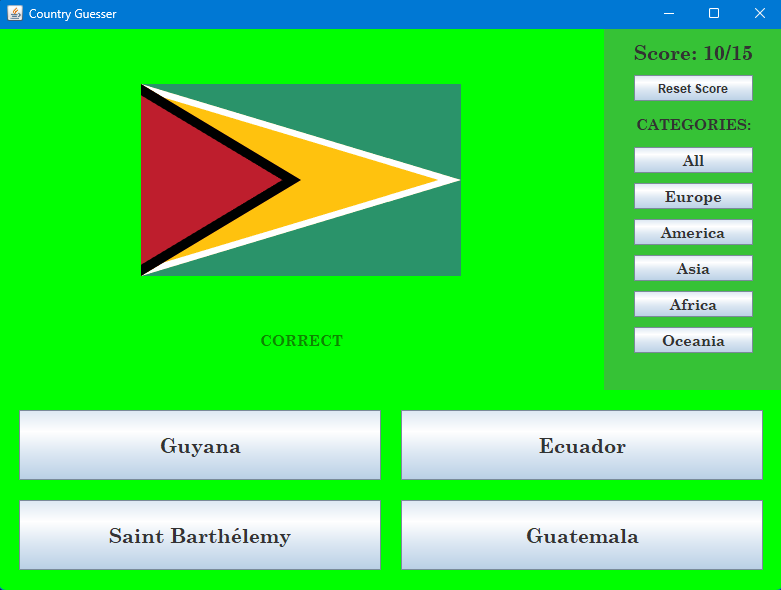
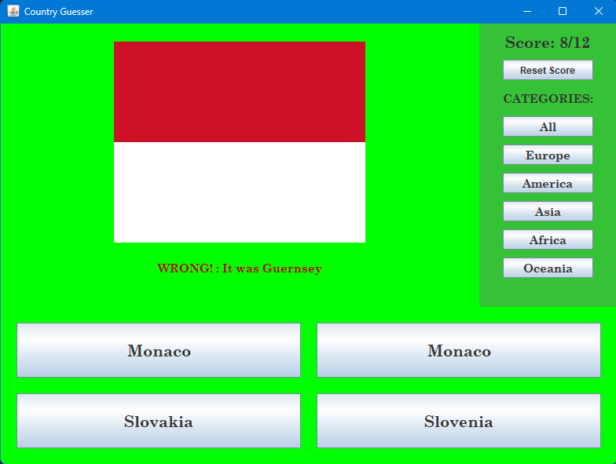

# FlagGuesser

FlagGuesser is a flag guessing game where players are presented with a flag and they have to choose the correct country out of 4 options. Players gain points by selecting the correct country.

## How to Run

1. Run the `FlagGuesser.jar` file located in the `out` directory.
2. Before launching the game, ensure you have a stable internet connection.
3. Upon launching the game, a flag will be displayed, and the user will be presented with 4 options to guess the correct country.
4. The scoring system awards points for correct guesses and updates the score.
5. If desired, players can reset their score and start over with a new flag.
6. Players have the option to choose categories including Europe, Asia, America, Africa, Oceania, or all.

## Project Structure

- `src` directory: Contains the source code files.
- `out` directory: Includes compiled files and the executable JAR file of the project.
- `pom.xml` file: Contains Maven dependencies.

## Screenshots

Here are some screenshots showcasing the gameplay:

<!-- Add more screenshots if needed -->

## Requirements

- Java 8 or higher version
- Stable internet connection

## Notes

- The project is developed using Java language with the Swing library and Maven.

## Contributions

Contributions to the project are welcome! Feel free to fork the repository and submit a pull request with any improvements or new features.
